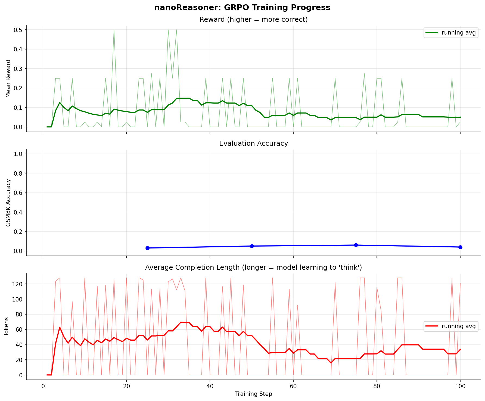

# nanoReasoner

Teaching language models to think via reinforcement learning. One file. One GPU. One reward: is the math right?

This is a minimal, single-file implementation of [GRPO](https://arxiv.org/abs/2402.03300) (Group Relative Policy Optimization) — the algorithm behind [DeepSeek R1](https://arxiv.org/abs/2501.12948)'s reasoning capabilities. It takes a pretrained language model, shows it math problems, generates multiple solution attempts, rewards the correct ones, and repeats. Over hundreds of iterations, the model learns to produce step-by-step reasoning before answering.

No reward model. No human feedback. No critic network. Just math problems with checkable answers.

The repo has one file that matters:

- **`nanoreasoner.py`** — model, GRPO algorithm, training loop, evaluation, visualization, git tracking (~1,000 lines)

## quickstart

```bash
# Install dependencies
pip install torch transformers datasets matplotlib

# Fine-tune Qwen2.5-0.5B with simplified GRPO (runs on free Colab T4)
python nanoreasoner.py --model Qwen/Qwen2.5-0.5B --mode nano --G 2 --batch-size 2 --total-steps 100

# Scale up on better hardware (RTX 4090 / A100)
python nanoreasoner.py --model Qwen/Qwen2.5-1.5B --mode standard --G 4

# DeepSeek R1-style with KL penalty
python nanoreasoner.py --model Qwen/Qwen2.5-1.5B --mode full --G 8

# From-scratch tiny GPT (educational, reasoning won't fully emerge)
python nanoreasoner.py --model scratch --depth 8 --mode nano --G 16 --total-steps 200

# Evaluate a checkpoint
python nanoreasoner.py --eval --checkpoint runs/my_run/final
```

## results: Colab T4, Qwen2.5-0.5B, 100 steps, $0

Trained for ~3 hours on a free Google Colab T4 GPU.

**GSM8K accuracy: 3% → 6% at peak (step 75)**

Before training (step 25):
```
Q: At the local Pick Your Own fruit orchard, peaches cost $2/lb, plums...
A: Step 1: Calculate the cost of the peaches.
   Cost = Price per pound × Number of pounds.
   The cost of the peaches is $2.00 × 6 = $12.00.

   Step 2: Calculate the cost of the plums. Usin...
   Pred: 18.00 ✗ (Gold: 38)
```

After training (step 75):
```
Q: Jana has 27 puppies. Two thirds are Pomeranians. One third of the Pomeranians are girls.
A: Step 1: We are given that Jana has 27 puppies.
   Step 2: Two thirds of the puppies are Pomeranians. 2/3 of 27 = 18 Pomeranians.
   Step 3: One third of the Pomeranians are girls. 1/3 of 18 = 6.
   Pred: 6 ✓ (Gold: 6)

Q: Jairus gets $0.8 per task, Jenny gets $0.5. Each finished 20 tasks.
A: Jairus gets $0.8 * 20 = $16. Jenny gets $0.5 * 20 = $10. Jairus gets $16 - $10 = $6 more.
   Pred: 6 ✓ (Gold: 6)
```

The model learned to produce step-by-step arithmetic reasoning from pure RL signal. No chain-of-thought examples in the training data. No supervised fine-tuning on reasoning traces. Just binary reward: did you get the number right?



## what happens during training

Every step:
1. Sample a batch of GSM8K math problems
2. Generate G completions per problem
3. Check each answer against the gold answer (binary reward: right or wrong)
4. Compute group-relative advantages (correct attempts get positive advantage, wrong ones get negative)
5. Update the model to make correct reasoning paths more likely

The completion length increasing is the signal. The model is learning to "think longer" before answering.

## three modes

| Mode | Algorithm | What it teaches |
|------|-----------|-----------------|
| `nano` | REINFORCE + group baseline | How RL gradients work on language |
| `standard` | Full GRPO with PPO clipping | Importance sampling and trust regions |
| `full` | GRPO + KL penalty + ref model | How DeepSeek R1 actually works |

When `mode=nano`, the algorithm reduces to: *make correct completions more likely, make wrong ones less likely, normalize within the group*. That's it. Everything else is optimization.

## hardware

| Setup | Model | G | VRAM | Time/step |
|-------|-------|---|------|-----------|
| Colab T4 (free) | Qwen2.5-0.5B | 2 | ~8 GB | ~45s |
| RTX 4090 (24GB) | Qwen2.5-1.5B | 4 | ~18 GB | ~30s |
| DGX Spark (128GB) | Qwen2.5-3B | 16 | ~40 GB | ~20s |

The 0.5B model is the floor for reasoning emergence. At 1.5B+ expect 10-20 point accuracy gains. At 3B+ you'll see self-verification and search behaviors emerge (per TinyZero).

## the algorithm

GRPO eliminates the critic network from PPO. Instead of learning "how good is this state?", it estimates advantage by comparing completions within a group:

```
advantage[i] = (reward[i] - mean(rewards)) / std(rewards)
```

If you generated 8 solutions and 2 are correct, those 2 get positive advantage and the 6 wrong ones get negative. The policy gradient reinforces token sequences that led to correct answers.

In nano mode, ratio=1 (on-policy), no clipping, no KL. Pure signal.

## outputs

Training produces:
```
runs/my_run/
├── config.json              # full experiment config
├── history.json             # metrics at every step
├── training_curves.png      # reward, accuracy, length plots
├── step_000050/             # intermediate checkpoint
└── final/                   # final model weights
```

## lineage

This builds on:
- **[nanochat](https://github.com/karpathy/nanochat)** — GRPO scaffolding in `scripts/chat_rl.py`
- **[DeepSeek R1](https://arxiv.org/abs/2501.12948)** — the GRPO algorithm and pure-RL reasoning
- **[TinyZero](https://github.com/Jiayi-Pan/TinyZero)** — proved 3B models develop reasoning via GRPO for <$30
- **[autoresearch](https://github.com/karpathy/autoresearch)** — git-based experiment tracking pattern
- **[reasoning-from-scratch](https://github.com/rasbt/reasoning-from-scratch)** — Raschka's educational GRPO

The goal is Karpathy-style: strip everything to the minimum needed to see the phenomenon. One file. Read it top to bottom. Understand how RL teaches language models to think.

## license

MIT
